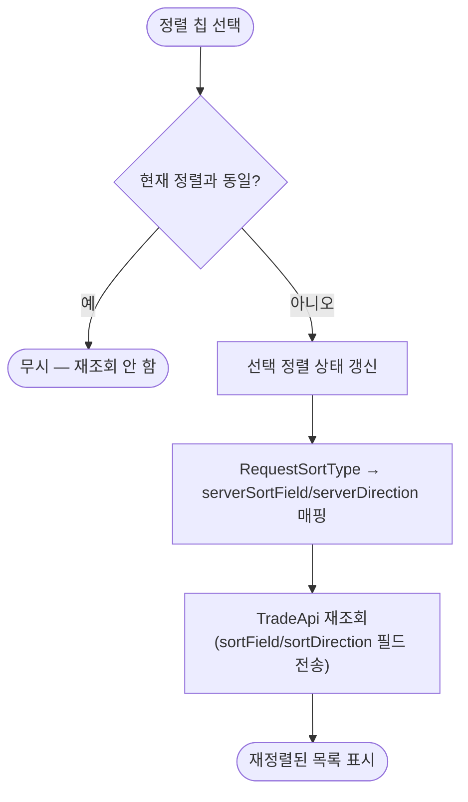

# 요청 목록 정렬·필터 기능 추가

## 개요
요청 관리 화면(받은/보낸 요청)에 정렬 기능을 추가하고, BE 정렬 API와 연동했다. 정렬 칩 선택 시 `sortField`/`sortDirection`을 서버로 전송해 재조회한다.

## 기능 흐름

## 변경 사항

### 정렬 enum
- `lib/enums/request_sort_type.dart`: 단일 `serverName` 필드를 `serverSortField`(BE `TradeRequestSortField` enum)와 `serverDirection`(`ASC`/`DESC`)으로 분리. 최신순=`CREATED_DATE/DESC`, 가격 높은순=`PRICE/DESC`, 가격 낮은순=`PRICE/ASC`, AI 추천순=`AI_RECOMMENDED/DESC`. 가격 높은/낮은순은 동일 sortField에 방향만 다르다.

### 요청 모델
- `lib/models/apis/requests/trade_request.dart` (+ `.g.dart`): `sortField`, `sortDirection` 필드 추가 및 직렬화 반영.

### API
- `lib/services/apis/trade_api.dart`: 받은/보낸 요청 조회 시 `sortField`/`sortDirection`이 null이 아니면 multipart 필드로 전송.

### 화면
- `lib/screens/request_management_tab_screen.dart`: 받은/보낸 요청 로드 시 현재 선택 정렬 타입의 server 값 전달. 정렬 칩 `onChanged`에서 동일 정렬 재선택 시 early return, 변경 시 서버 재조회 호출.

## 주요 구현 내용
- **sortField/direction 분리**: BE의 `TradeRequestSortField` + `Sort.Direction` 구조에 맞춰 정렬 기준과 방향을 분리해 매핑.
- **동일 정렬 재선택 가드**: 불필요한 서버 재조회·리빌드 방지.

## 주의사항
- AI 추천순은 서버에서 방향(DESC)을 무시하고 추천 점수 순으로 정렬한다.
- 보낸 요청 탭은 물품 카드별로 요청을 병렬 조회하므로, 정렬 변경 시 모든 카드가 재조회된다.
