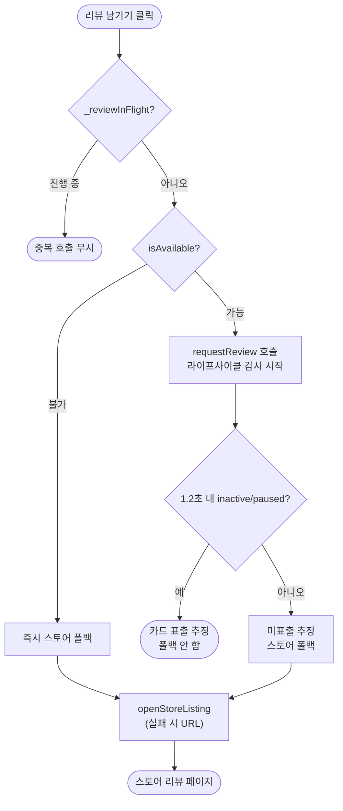

# 광고 슬롯 노출 타이밍 및 카드 펼침 애니메이션 재실행

## 개요
홈 피드에서 광고 슬롯 ↔ 일반 카드 전환 시 하단 카드덱 펼침(팬) 애니메이션이 다시 재생되던 문제와, 인앱 리뷰 카드가 표출되지 않았을 때 스토어 폴백이 누락되던 문제를 함께 해결했다.

## 기능 흐름

## 변경 사항

### 카드 펼침 애니메이션 재실행 방지
- `lib/screens/home_tab_screen.dart`: 우상단 알림/신고 메뉴 버튼을 조건부 `if`로 트리에서 제거하던 방식을 `Offstage`로 변경. 조건부 제거 시 `Stack` children 개수가 바뀌어 형제 위젯 `HomeTabCardHand`가 remount되며 펼침 애니메이션이 재생되던 문제를, element를 유지(children 개수 고정)하는 `Offstage(offstage: 광고슬롯 여부)`로 해결.

### 인앱 리뷰 카드 표출 추정 + 스토어 폴백
- `lib/services/app_review_service.dart`:
  - `WidgetsBindingObserver` 적용. `requestReview()`가 카드 표출 여부를 반환하지 않는 한계를, 호출 직후 앱이 `inactive`/`paused`로 전환되는지(시스템 오버레이가 올라옴)를 1.2초 내 감지해 표출을 추정.
  - 표출 추정 실패 시 `openStoreListing(appStoreId)`(실패 시 url_launcher)로 스토어 폴백.
  - `isAvailable=false`(플레이서비스 없음 등)면 추정 없이 즉시 스토어 폴백.
  - `_reviewInFlight` 플래그로 연타 재진입 차단(싱글톤 공유 상태 덮어쓰기 방지).

## 주요 구현 내용
- **Offstage 패턴**: Stack children 개수를 고정해 형제 위젯의 불필요한 remount를 막는 것이 애니메이션 재실행 방지의 핵심.
- **라이프사이클 기반 표출 추정**: 플러그인이 결과를 주지 않으므로 OS 라이프사이클 전이를 신호로 사용. 1.2초 대기 후 신호가 없으면 미표출로 간주.

## 주의사항
- 표출 추정은 라이프사이클 휴리스틱이라 OS 정책/타이밍에 따라 오탐 가능성이 있다. 다만 오탐 시에도 스토어 페이지로 이동하므로 "아무 반응 없음"보다 안전한 폴백이다.
