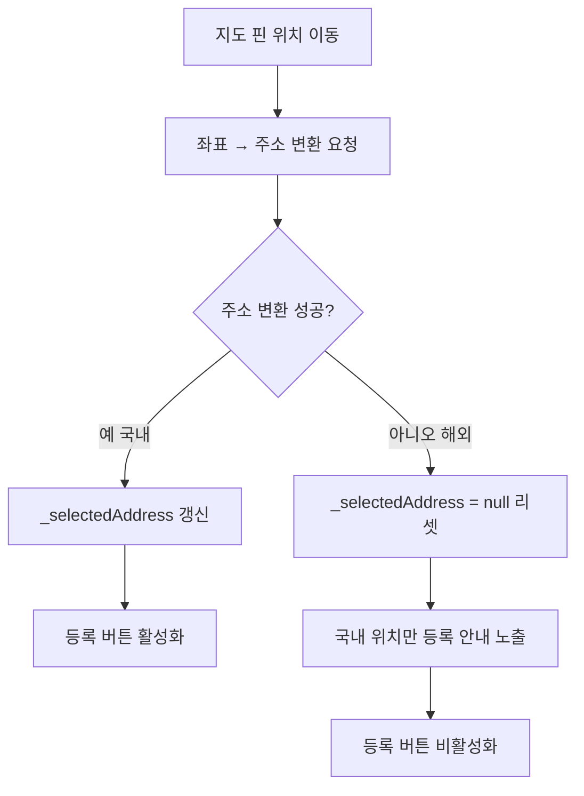

# 해외 위치 핀 선택 시 위치 등록 버튼 비활성화

## 개요
물품 등록 위치 선택 화면에서 지도 핀을 해외 좌표로 옮기면, 직전에 선택했던 국내 주소가 상태에 그대로 남아(stale state) 잘못된 위치가 등록되는 버그가 있었다. 이를 해결하기 위해 좌표→주소 변환에 실패한 경우(해외 등) `_selectedAddress`를 명시적으로 `null`로 리셋하고, '국내 위치만 등록할 수 있어요' 안내를 노출하며, 주소가 없으면 등록 버튼을 비활성화한다.

## 기능 흐름

## 변경 사항

### 위치 등록 화면 stale state 방지 및 안내
- `lib/screens/item_register_location_screen.dart`: `_updateAddress`에서 주소 변환 결과를 조건 없이 setState로 반영(변환 실패 시 `_selectedAddress = null`). 해외 좌표(주소 미수신) 시 '국내 위치만 등록할 수 있어요' 안내 컨테이너를 지도 위에 노출

## 주요 구현 내용
- 기존에는 주소 변환에 성공한 경우(`address != null`)에만 setState를 호출해, 해외 좌표로 옮겨도 직전 국내 주소가 상태에 남는 버그가 있었다. 변경 후에는 `mounted` 가드 뒤에서 변환 결과(`address`, null 포함)를 항상 setState로 반영해 stale state를 제거했다.
- `_currentPosition != null && _selectedAddress == null` 조건일 때, 지도 하단(`bottom: 110.h`)에 반투명 검정 배경의 '국내 위치만 등록할 수 있어요' 안내를 `Positioned`로 노출한다.
- 안내 텍스트는 `CustomTextStyles.p2` + `AppColors.textColorWhite`, 배경은 `AppColors.opacity80Black`을 사용해 프로젝트 스타일 규칙을 준수한다.
- `_selectedAddress == null`이면 등록 버튼이 비활성화되어, 주소가 확정되지 않은 해외 위치가 등록되는 것을 원천 차단한다.

## 주의사항
- 주소 변환은 비동기이므로 `_updateAddress` 내 setState 직전 `mounted` 체크로 dispose 이후 setState 예외를 방지한다.
- 안내 컨테이너 위치(`bottom: 110.h`)가 하단 등록 버튼과 겹치지 않는지, iPad 등 대형 기기에서도 적절히 표시되는지 확인이 필요하다.
- 국내↔해외 좌표를 빠르게 오갈 때, 직전 변환 응답이 늦게 도착해 상태를 덮어쓰지 않는지(race) 주의가 필요하다.
