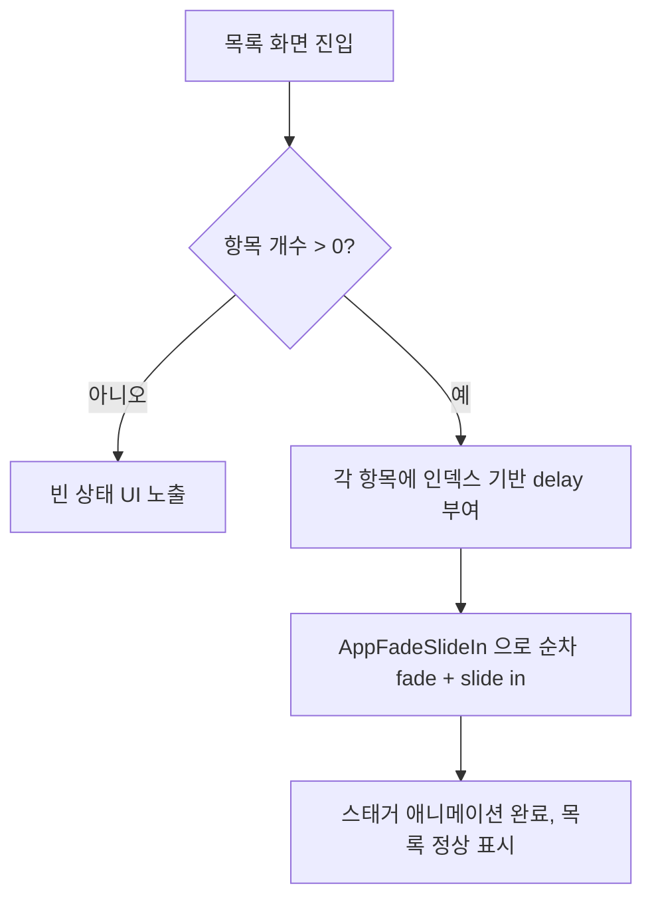

# 목록 화면 AppFadeSlideIn 스태거 애니메이션 통일

## 개요
앱 내 주요 목록 화면들이 각기 다른 진입 연출(즉시 표시 또는 제각각의 애니메이션)을 사용해 일관성이 떨어지는 문제를 해결한다. 채팅방·좋아요·내 등록물품·요청관리·차단관리 5개 목록 화면에 `AppFadeSlideIn` 기반 스태거(stagger) 애니메이션을 공통 적용해, 화면 진입 시 항목이 위에서부터 순차적으로 fade + slide in 되도록 연출을 통일했다.

## 기능 흐름

## 변경 사항

### 목록 화면 애니메이션 적용
- `lib/screens/chat_tab_screen.dart`: 채팅방 목록 항목에 `AppFadeSlideIn` 스태거 적용
- `lib/screens/my_like_list_screen.dart`: 좋아요 목록 항목에 스태거 적용
- `lib/screens/my_register_item_screen.dart`: 내 등록물품 목록 항목에 스태거 적용
- `lib/screens/request_management_tab_screen.dart`: 요청관리 목록 항목에 스태거 적용
- `lib/screens/block_management_screen.dart`: 차단관리 목록 항목에 스태거 적용

## 주요 구현 내용
- 각 목록 화면의 항목 빌더에서 항목 인덱스에 비례한 delay를 계산해 `AppFadeSlideIn` 위젯으로 감싼다. 인덱스가 클수록 늦게 등장해 위에서부터 차례대로 나타나는 스태거 효과를 만든다.
- fade(투명도)와 slide(위치 이동)를 동시에 적용해, 항목이 아래에서 살짝 올라오며 서서히 선명해지는 통일된 연출을 제공한다.
- 5개 화면 모두 동일한 컴포넌트(`AppFadeSlideIn`)를 사용해 연출 파라미터(지속시간·이동거리·delay 간격)의 일관성을 보장한다.

## 주의사항
- 항목 수가 매우 많을 경우 누적 delay가 과도하게 길어지지 않도록 delay 상한/간격을 적정하게 유지해야 한다.
- 목록이 비어 있는 경우(빈 상태 UI)에는 애니메이션이 적용되지 않으며, 깜빡임 없이 empty 화면이 노출되어야 한다.
- 화면 재진입 시에도 애니메이션이 재생되므로, 스크롤 위치나 항목 순서가 어긋나지 않는지 확인이 필요하다.
