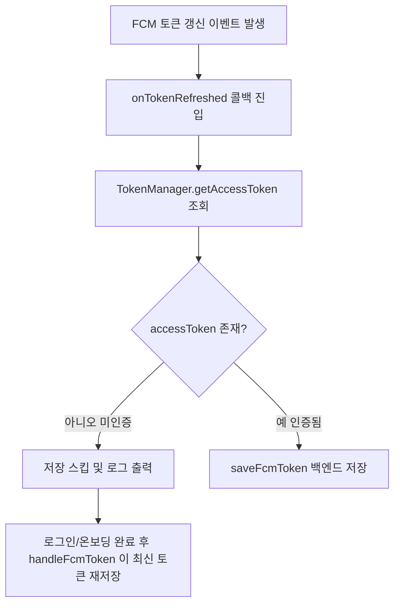

# 앱 실행 시 FCM 토큰 갱신 백엔드 미반영으로 푸시 실패

## 개요
앱 실행(main) 시점에 FCM 토큰 갱신 리스너를 등록하면 아직 인증이 완료되지 않은 상태에서 토큰 갱신 이벤트가 도달해 saveFcmToken API가 인증 누락으로 silent fail 하고, 그 결과 갱신된 토큰이 백엔드에 반영되지 않아 푸시 알림이 실패하는 문제를 해결했다. 토큰 갱신 콜백 실행 시점에 accessToken 유무를 확인해 미인증 상태에서는 저장을 스킵하고, 로그인/온보딩 완료 후 handleFcmToken()이 최신 토큰을 다시 저장하도록 했다. 또한 FirebaseService에 싱글톤 패턴을 적용해 인스턴스/리스너 상태를 일관되게 관리한다.

## 기능 흐름

## 변경 사항
### 앱 초기화
- `lib/main.dart`: main()에서 `_setupFcmTokenRefreshListener()` 호출 및 관련 헬퍼/`notification_api` import 제거. 토큰 갱신 처리를 인증 완료 이후 경로로 위임

### Firebase 서비스
- `lib/services/firebase_service.dart`: 싱글톤 패턴 적용(`_instance`, `factory`, `_internal`). `setupTokenRefreshListener`의 토큰 갱신 콜백에서 `TokenManager().getAccessToken()`으로 인증 토큰 유무 확인 후 미인증 시 저장 스킵. 토큰 값 로그 출력 제거(민감정보 노출 방지)

## 주요 구현 내용
- 인증 시점 가드: `onTokenRefreshed` 콜백 내부에서 `TokenManager().getAccessToken()` 결과가 null이면 저장을 스킵하고 '인증 전 토큰 갱신 감지 → 저장 스킵' 로그만 남긴다. 인증 완료 후 handleFcmToken()이 최신 토큰을 다시 저장하므로 누락이 발생하지 않는다.
- 싱글톤 적용: `FirebaseService()`가 항상 동일 인스턴스를 반환하도록 변경해 `_tokenRefreshListenerSet` 등 내부 상태가 공유되고 리스너가 중복 등록되지 않는다.
- 리스너 등록 시점 이동: main()에서의 조기 리스너 등록을 제거해 미인증 구간에서의 불필요한 저장 시도 자체를 줄였다.

## 주의사항
- 토큰 값을 로그에 직접 출력하던 부분을 제거했다(민감정보 노출 방지).
- 저장 스킵은 누락이 아니라 인증 완료 후 재저장으로 보완되는 설계이므로, handleFcmToken() 호출 경로가 로그인/온보딩 완료 시 반드시 실행되어야 한다.
- `_tokenRefreshListenerSet` 가드로 리스너는 1회만 등록된다.
