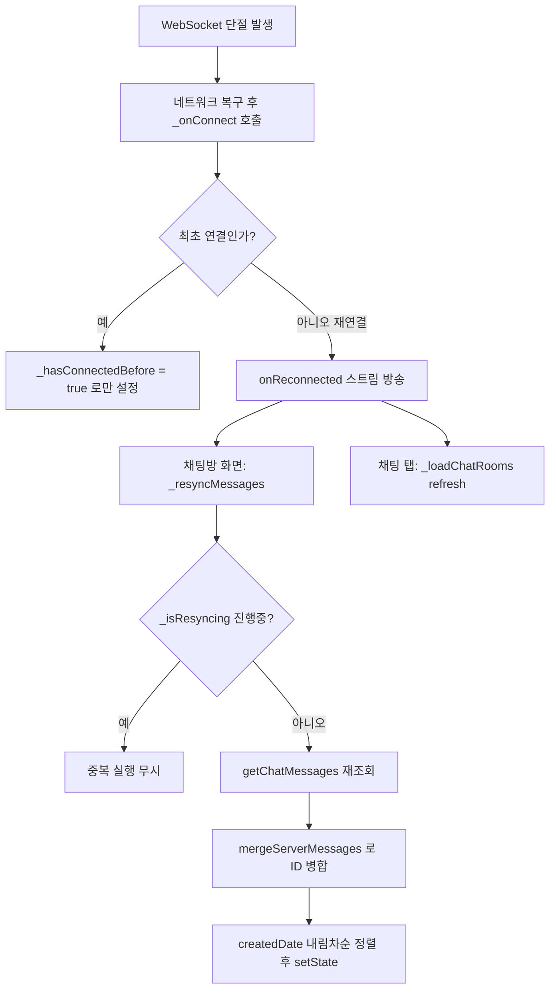

# 갤럭시에서 채팅 메시지 실시간 미표시 (WebSocket 반복 단절)

## 개요
갤럭시(Android) 단말에서 WebSocket이 반복적으로 단절되며, 단절 구간 동안 도착해야 할 메시지가 실시간으로 표시되지 않는 문제를 해결했다. 핵심은 WebSocket 재연결을 감지하는 동기화 계층을 새로 추가한 것이다. 재연결 시 서버에서 최신 메시지를 재조회해 단절 구간 유실분을 병합하고, 내 텍스트 메시지는 WS 에코를 기다리지 않고 낙관적으로 즉시 삽입하며, 지연 수신 메시지가 잘못된 시각으로 밀리던 DateTime.now() 폴백을 제거했다.

## 기능 흐름

## 변경 사항
### WebSocket 서비스
- `lib/services/chat_websocket_service.dart`: `_hasConnectedBefore` 플래그와 `_reconnectController` 브로드캐스트 스트림 추가, `onReconnected` getter 노출. `_onConnect`에서 최초 연결이 아니면 재연결로 간주해 신호 방송. 메시지 시각 확정에서 `DateTime.now()` 폴백 제거(`headerTs ?? payloadTs`, 둘 다 없으면 null 유지)

### 채팅방 화면
- `lib/screens/chat_room_screen.dart`: 순수 함수 `mergeServerMessages` 추가(테스트 대상), `_reconnectSubscription`으로 onReconnected 구독, `_resyncMessages`로 단절 구간 재조회·병합, 내 텍스트 메시지 낙관적 삽입(local_ 접두 ID) 및 자동 스크롤, dispose에서 구독 해제

### 채팅 탭 화면
- `lib/screens/chat_tab_screen.dart`: `_reconnectSubscription`으로 onReconnected 구독해 재연결 시 목록 refresh, dispose에서 구독 해제

### 테스트
- `test/services/chat_message_merge_test.dart`: `mergeServerMessages` 병합/교체/보존/정렬/null 처리 단위 테스트 5건 추가

## 주요 구현 내용
- 재연결 감지: `_onConnect`는 구독 재연결 후 `_hasConnectedBefore`가 true일 때만 `onReconnected`를 방송한다. 최초 연결은 신호를 보내지 않아 불필요한 재조회를 막는다.
- 메시지 병합(`mergeServerMessages`): 현재 목록(reverse 정렬, index 0이 최신)을 순회하며 서버에 존재하는 ID는 서버 버전으로 교체(시각 교정), 낙관적 로컬 메시지(local_/uploading_/ws_img_/local_trade_request_ 접두)는 서버에 없어도 보존, 서버에만 있는 신규 메시지는 추가한다. 최종적으로 createdDate 내림차순 정렬, null은 맨 뒤로 보낸다.
- 낙관적 삽입: 전송 시 `local_<microsecond>` ID의 임시 메시지를 즉시 목록 0번에 삽입하고 `_pendingLocalMessages`에 등록한다. WS 에코 도착 시 `_handleIncomingMessage`의 매칭 로직이 실제 서버 메시지로 교체한다.
- 시각 폴백 제거: 헤더/페이로드 시각이 모두 없을 때 `DateTime.now()`를 쓰면 지연 수신 메시지가 수신 시각으로 밀려 표시되므로 제거하고, 재연결 동기화 시 서버 createdDate로 교정한다.

## 주의사항
- `_resyncMessages`는 백그라운드 동기화이므로 실패해도 사용자에게 노출하지 않고 다음 재연결 시 재시도한다.
- `_isResyncing` 가드로 재연결 이벤트 다발 시 동기화 중복 실행을 방지한다.
- WebSocket은 싱글톤이므로 채팅 탭 dispose에서 disconnect하지 않고 구독만 해제한다.
- 재조회 페이지는 pageSize 50으로 고정되어 있어, 단절 구간 유실이 50건을 초과하는 극단적 상황은 다음 페이징/추가 동기화에 의존한다.
