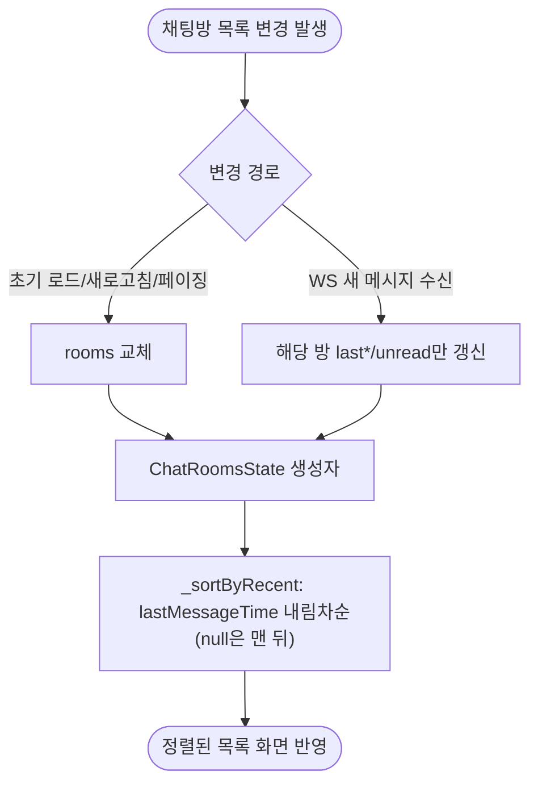

# 채팅방 목록이 마지막 메시지 최신순으로 정렬되지 않음

## 개요
리팩토링 과정에서 누락된 채팅방 목록 최신순 정렬을 복구했다. 정렬 책임을 `ChatRoomsState` 생성자에 내장해 모든 갱신 경로(초기 로드·새로고침·페이징·WebSocket 수신)가 항상 `lastMessageTime` 내림차순 정렬을 보장하도록 만들었다.

## 기능 흐름

## 변경 사항

### 상태 모델
- `lib/states/chat_rooms_state.dart`: 생성자를 `const`에서 일반 생성자로 변경하고 `rooms = _sortByRecent(rooms)`로 항상 정렬 보관. `_sortByRecent`는 `lastMessageTime` 내림차순, null은 맨 뒤로 정렬하며 원본 입력 리스트를 변형하지 않는다. `copyWith`도 동일 생성자를 거쳐 정렬 유지.

### Provider
- `lib/providers/chat_rooms_provider.dart`: `onMessageReceived`에서 수동 "맨 앞 이동" 로직(`[updated, ...where]`)을 제거하고, 해당 방 인덱스만 교체. 순서는 State 생성자가 자동 정렬하므로 중복 로직 제거.

### 테스트
- `test/states/chat_rooms_state_test.dart`: 정렬·null 처리·copyWith 유지·원본 불변 검증.
- `test/providers/chat_rooms_provider_sort_test.dart`: WS 수신으로 오래된 방 시각 갱신 시 최상단 이동 검증.

## 주요 구현 내용
- **단일 소유자 원칙**: 채팅방 목록의 정렬 책임을 State 생성자 한 곳에 집중시켜, 갱신 경로가 늘어나도 정렬 누락이 재발하지 않도록 했다.
- WS 수신 시 맨 앞 강제 이동을 제거함으로써 "동일 시각 방 순서 꼬임" 등의 부작용도 함께 제거.

## 주의사항
- 정렬은 생성자에서 매번 수행되므로 방 개수가 매우 많을 경우 정렬 비용이 있으나, 일반적인 채팅방 수에서는 무시 가능한 수준이다.
