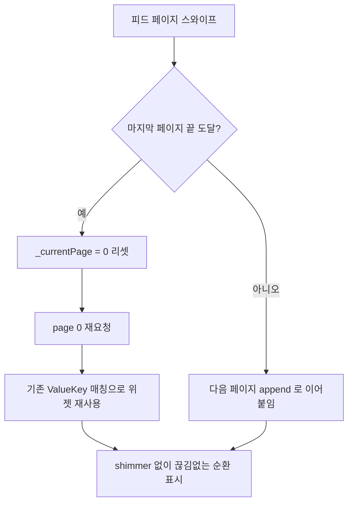

# 홈 피드 끝 도달 시 끊김없는 순환 + shimmer 제거

## 개요
홈 피드를 끝까지 넘기면 더 이상 표시할 항목이 없어 빈 화면이 되거나, 새 페이지를 불러올 때 항목마다 shimmer(스켈레톤)가 다시 깜빡이며 사용자 경험을 끊는 문제가 있었다. 이를 해결하기 위해 피드 끝에 도달하면 page 0을 다시 요청해 끊김없이 순환하도록 하고, 각 피드 항목에 고유 키(`ValueKey`)를 부여해 기존 위젯이 재사용되도록 만들어 shimmer 재등장을 제거했다.

## 기능 흐름

## 변경 사항

### 홈 피드 순환 및 위젯 키 처리
- `lib/screens/home_tab_screen.dart`: 끝 도달 시 `_currentPage`를 0으로 리셋한 뒤 page 0을 재요청해 끊김없이 순환하도록 수정. 각 `HomeFeedItemWidget`에 `ValueKey('uuid_feedIndex')`를 부여하고, append/replace 구분을 위한 `feedRevision` 개념을 도입

## 주요 구현 내용
- 피드 끝에 도달하면 `_currentPage = 0`으로 되감고 page 0을 다시 조회한다. 사용자는 목록 끝에서 막히지 않고 처음부터 자연스럽게 이어보게 된다.
- 각 피드 항목 위젯에 `ValueKey('uuid_feedIndex')` 형태의 안정적인 키를 부여한다. Flutter가 동일 키의 기존 위젯을 재사용하므로, 페이지가 추가될 때 이미 그려진 항목들이 다시 빌드되며 shimmer가 깜빡이는 현상이 사라진다.
- `feedRevision` 값으로 "이어붙이기(append)"인지 "통째 교체(replace)"인지를 구분해, 순환·새로고침으로 목록이 바뀔 때와 페이지를 추가할 때의 동작을 명확히 분리한다.

## 주의사항
- `ValueKey`는 `uuid`와 `feedIndex` 조합으로 생성되므로, 동일 아이템이 서로 다른 위치(feedIndex)에 나타날 때 키가 충돌하지 않아야 한다.
- 순환 시 page 0을 재요청하므로, 서버의 추천/정렬 결과가 갱신되면 같은 항목이 다른 순서로 다시 보일 수 있다(의도된 동작).
- 피드 풀이 매우 작은 경우(항목 수가 한 페이지 미만)에도 끊김없는 순환이 정상 동작하는지 확인이 필요하다.
