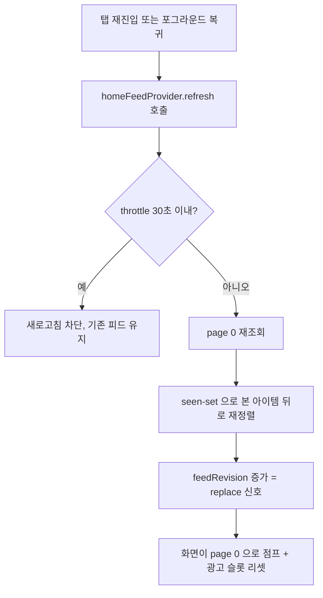

# 홈 피드 자동 새로고침 + seen-set 중복노출 방지

## 개요
홈 탭에 재진입하거나 앱이 백그라운드에서 포그라운드로 복귀할 때 피드를 자동으로 새로고침하되, 이미 본 아이템이 다시 위쪽에 노출되어 같은 항목을 반복해서 보는 문제를 막는다. 이를 위해 홈 피드 상태를 Riverpod provider로 단일 소유하도록 4-레이어 구조(repository/state/provider)로 재구성하고, `feedRevision`(replace 카운터)으로 append/replace를 명시적으로 구분하며, seen-set(본 아이템 집합)을 이용해 이미 본 아이템을 새로고침 결과의 뒤로 재정렬한다.

## 기능 흐름

## 변경 사항

### 홈 피드 상태 4-레이어 provider 구조
- `lib/repositories/home_feed_repository.dart`: 단일 페이지를 단일 정렬 필드로 조회하는 repository (API 래핑)
- `lib/providers/home_feed_repository_provider.dart`: repository 주입용 plain Provider (테스트 override 가능)
- `lib/states/home_feed_state.dart`: `@immutable` 상태 모델. `items`/`currentPage`/`hasMoreItems`/`currentSortField`/`seenItemIds`/`lastRefreshAt`/`feedRevision` 보유. `copyWith`/`==`/`hashCode` 구현
- `lib/providers/home_feed_provider.dart`: `AsyncNotifier` 기반 단일 소유 provider. 정렬 폴백 초기 로드, `loadMore`(끝 도달 시 page 0 되감기), `refresh`(throttle + replace) 로직

### enum 및 위젯
- `lib/enums/refresh_trigger.dart`: 새로고침 트리거 종류(`tabReentry`/`foregroundResume`) — 로깅/디버깅 구분용
- `lib/models/home_feed_item.dart`: API 응답(`Item`)을 `HomeFeedItem` 리스트로 변환하는 `fromItems` 정적 메서드 추가
- `lib/widgets/home_feed_refresh_indicator.dart`: 자동 새로고침 중에만 노출되는 얇은 progress 바(풀스크린 스켈레톤 대체)

### 화면/메인 연동
- `lib/screens/home_tab_screen.dart`: 로컬 상태 관리를 제거하고 `homeFeedProvider` 구독으로 전환. `feedRevision` 변화로 replace를 감지해 page 0 점프 + 광고 슬롯 리셋
- `lib/screens/main_screen.dart`: 다른 탭→홈 탭(0) 전환 및 포그라운드 복귀 시 `refresh` 호출

## 주요 구현 내용
- 기존에는 위치(인덱스) 기반으로 append/replace를 역추론(`_isPrefix`)했는데, 초기 페이지가 적게 와서 새 피드 길이가 더 길어지는 경우 refresh를 append로 오분류하는 버그가 있었다. 이를 폐기하고, `HomeFeedState.feedRevision`을 추가해 `refresh`(replace)에서만 카운터를 증가시킨다. 화면은 이 값의 변화만으로 통째 교체를 명확히 인지하므로 오분류가 원천 차단된다.
- `refresh`는 `lastRefreshAt` 기준 30초 throttle을 적용하고, 실패는 silent 처리해 기존 items를 유지한다. 새로고침 중에는 이전 데이터를 보존한 채 얇은 progress 바만 노출한다.
- seen-set(`LinkedHashSet<String>`, 삽입순 보존 LRU, 최대 100개)으로 본 아이템을 추적하고, 새로고침 결과에서 이미 본 아이템을 뒤로 재정렬(`_reorderBySeen`)해 같은 항목이 위쪽에 반복 노출되는 것을 막는다.
- `loadMore`는 끝 도달 시(빈 페이지) `currentPage`를 0으로 되감고 seen-set을 클리어해 끊김없이 순환한다(append, `feedRevision` 불변).
- `MainScreen`이 `IndexedStack`이라 탭 전환 시 `initState`가 재실행되지 않아 로컬 상태가 stale해지는 함정을, provider 단일 소유 + 구독으로 해소한다.

## 주의사항
- `refresh`와 `loadMore`는 `state.isLoading` 가드로 중복 진행을 방지한다.
- throttle 간격(30초)·seen-set 최대 크기(100)는 spec 기준 상수(`kHomeFeedRefreshThrottle`, `kHomeFeedSeenSetMaxSize`)로 관리되며 테스트에서 검증된다.
- `feedRevision` 증가 시 화면은 page 0으로 점프하고 광고 슬롯을 리셋하므로, 새로고침 직후 사용자가 보던 위치가 맨 위로 이동한다(의도된 동작).
- 포그라운드 복귀 자동 새로고침은 현재 탭이 홈(0)일 때만 동작한다.
