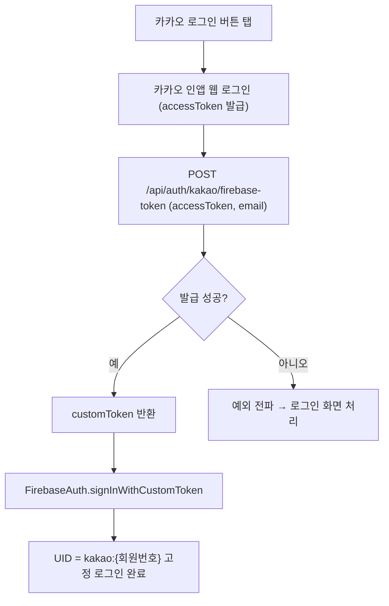

# 카카오 로그인 카카오앱 의존 제거 (인앱 웹 로그인)

## 개요
기존 카카오 로그인은 카카오톡 앱 설치를 전제로 했고, 미설치 기기에서는 스토어 이동 유도 다이얼로그를 띄워 앱 설치를 강제했다. 또한 Firebase 인증을 카카오 OIDC credential(`oidc.kakao`)로 직접 처리해, idToken의 aud를 네이티브 앱 키로 고정해야 하는 제약이 있었다. 이번 변경으로 카카오앱 의존을 제거하고 인앱 웹 로그인 경로로 전환했으며, Firebase 인증은 백엔드가 발급한 Custom Token으로 처리하도록 바꿨다. 이로써 설치 여부와 무관하게 동일한 로그인 흐름을 보장하고 Firebase UID가 `kakao:{회원번호}`로 고정된다.

## 기능 흐름

## 변경 사항
### API 레이어
- `lib/services/apis/rom_auth_api.dart`: `getKakaoFirebaseToken({required String kakaoAccessToken, String? email})` 추가. `/api/auth/kakao/firebase-token`에 accessToken과 email(마이그레이션 fallback 식별자)을 전송하고 응답의 `customToken`을 반환. 인증 불필요(`isAuthRequired: false`) 호출.

### 서비스 레이어
- `lib/services/kakao_auth_service.dart`:
  - 카카오톡 미설치 시 스토어 이동 다이얼로그(`_showKakaoTalkInstallDialog`) 제거 → `CommonModal`, `url_launcher`, `dart:io` import 제거.
  - 기존 OIDC credential 기반 `_signInWithFirebase(OAuthToken)` 제거, 백엔드 Custom Token 기반 `_signInWithFirebaseCustomToken({required String kakaoAccessToken, String? kakaoEmail})`로 대체.
  - 로그 마스킹 유틸 `_maskEmail`, `_maskUid` 추가. 이메일/UID/프로필 이미지 URL 등 민감정보를 마스킹하여 출력.

### iOS 설정
- `ios/Podfile.lock`: 의존성 변경에 따른 PODFILE CHECKSUM 갱신.

## 주요 구현 내용
- Firebase 인증 방식을 클라이언트 OIDC credential 생성에서 백엔드 발급 Custom Token으로 전환했다. 클라이언트는 카카오 accessToken만 확보해 백엔드에 위임하고, 백엔드가 회원을 식별해 `kakao:{회원번호}` UID로 고정된 Custom Token을 내려준다. 이로써 동일 계정 재로그인 시 UID 변동 문제가 사라진다.
- email은 기존 카카오 회원 마이그레이션을 위한 fallback 식별자로 nullable 전송한다.
- 로그 마스킹: `_maskEmail`은 `us**@e***.com` 형태로, `_maskUid`는 `kakao:123***` 형태로 가공하며, 프로필 이미지 URL은 로그에서 `(hidden)` 처리한다.

## 주의사항
- 백엔드 `/api/auth/kakao/firebase-token` 엔드포인트와 Firebase Custom Token 발급(서버 측 Admin SDK) 구성이 전제다. 엔드포인트 미가용 시 로그인 자체가 실패한다.
- 카카오톡 앱 설치 분기·스토어 이동 로직이 완전히 제거되었으므로, 설치 유도가 더 이상 동작하지 않는 것이 정상이다.
- Firebase 콘솔의 `oidc.kakao` provider 설정에 의존하지 않게 되었다(인증 경로가 Custom Token으로 일원화).
