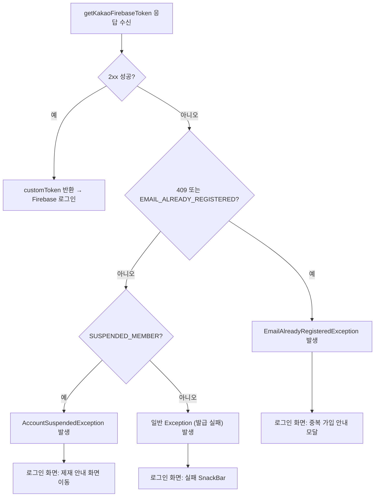

# 카카오 firebase-token 요청 오류 시 에러 처리 미흡

## 개요
카카오 인앱 웹 로그인 전환(#911)으로 도입된 `/api/auth/kakao/firebase-token` 호출은 오류 응답을 일반 `Exception`으로만 던져, 이메일 중복 가입이나 계정 정지 같은 사용자에게 안내가 필요한 케이스가 구분 없이 "로그인 실패"로 처리되는 문제가 있었다. 이번 변경으로 응답 코드/에러 코드에 따라 도메인 예외(`EmailAlreadyRegisteredException`, `AccountSuspendedException`)를 던지도록 분기해, 로그인 화면에서 각 상황에 맞는 안내(중복 가입 모달, 제재 안내 화면)를 표시할 수 있게 했다.

## 기능 흐름

## 변경 사항
### API 레이어
- `lib/services/apis/rom_auth_api.dart`: `getKakaoFirebaseToken`의 비정상 응답 처리 분기 추가.
  - `statusCode == 409` 또는 `errorCode == 'EMAIL_ALREADY_REGISTERED'` → `EmailAlreadyRegisteredException(registeredSocialPlatform: ...)` throw.
  - `errorCode == 'SUSPENDED_MEMBER'` → `AccountSuspendedException(suspendReason: ..., suspendedUntil: ...)` throw.
  - 그 외 → 기존 일반 `Exception('Firebase Custom Token 발급 실패: ...')` 유지.

## 주요 구현 내용
- 응답 body의 `code`와 HTTP statusCode를 함께 검사해 안내가 필요한 두 케이스를 도메인 예외로 분리한다.
- 중복 가입 케이스는 응답의 `registeredSocialPlatform`을 함께 전달해, 로그인 화면이 `displayPlatformName`(KAKAO→카카오, GOOGLE→구글, APPLE→Apple, 그 외→"다른 소셜")으로 변환해 안내한다.
- 정지 케이스는 `suspendReason`/`suspendedUntil`을 전달하며, 누락 시 빈 문자열(`?? ''`)로 대체해 null 크래시를 방지한다. 이 예외는 로그인 화면에서 제재 안내 화면(`AccountSuspendedScreen`)으로 라우팅된다.

## 주의사항
- 분기 분리만 추가했을 뿐 정상 응답 경로는 변경하지 않으므로, 정상 로그인 흐름에 회귀 영향이 없다.
- 예외의 실제 사용자 노출(중복 가입 모달 / 제재 화면 / 실패 SnackBar)은 `lib/widgets/login_button.dart`의 catch 분기에서 처리된다. 백엔드 에러 코드 문자열(`EMAIL_ALREADY_REGISTERED`, `SUSPENDED_MEMBER`)과 응답 필드명(`registeredSocialPlatform`, `suspendReason`, `suspendedUntil`)이 서버 계약과 정확히 일치해야 분기가 동작한다.
